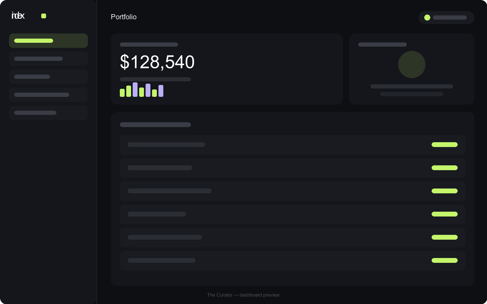
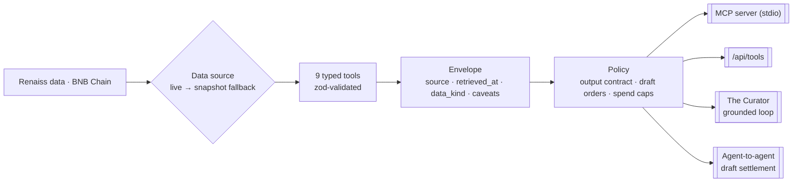

<div align="center">



&nbsp;

[](LICENSE)


### The agent layer for collectibles — value a vault, catch mispriced cards, prove pool fairness, and run rip‑or‑buy EV, as tools any AI agent can call.

Most collectibles tools answer one question: _what is it worth?_ **index** answers the one an agent actually needs before it acts — _what is it worth, **where did that number come from**, and what does it still **not** prove?_ It turns [Renaiss](https://www.renaiss.xyz) listings, pack odds, and on‑chain commitments into **9 typed tools** behind an open MCP server and a grounded collector agent — **the Curator** — where every answer arrives wrapped in its own provenance: source, timestamp, and the caveats that keep an estimate from masquerading as a fact.

**[ Watch the demo ↗ ](#-demo)** &nbsp;·&nbsp; **[ Live demo ↗ ](https://useindex.vercel.app)** &nbsp;·&nbsp; **[ MCP quickstart ↗ ](#use-it-from-any-mcp-client)** &nbsp;·&nbsp; **[ The math ↗ ](#the-math--published-and-tested)** &nbsp;·&nbsp; **[ Run it locally ↗ ](#run-it-locally)**

Built for the **Renaiss Hackathon**. _Probability and pricing math, not financial advice; FMV is an estimate._

</div>

---

## ▶ Demo

https://github.com/user-attachments/assets/65c05a09-a13a-4a95-bcd4-ca07a8651d52

_Video not playing? (GitHub only streams it to signed‑in users.) Watch it on YouTube instead:_

https://youtu.be/uD57yAcbpVM

---

## ▶ See it in one call

Every tool returns the same shape — a value **and** the receipt behind it. Ask the engine to value a rip of the Eden pack:

```bash
curl -s localhost:3000/api/tools \
  -H 'content-type: application/json' \
  -d '{"tool":"compute_pack_ev","input":{"pack_slug":"eden-pack"}}' | jq
```

```jsonc
{
  "ok": true,
  "envelope": {
    "data": {
      "pack_slug": "eden-pack",
      "cost": 150,
      "ev_per_rip": 119.61,          // odds-weighted expected value of one rip
      "ev_cost_ratio": 0.797,        // ~20% house edge — a $150 pack returns ~$120
      "std_dev": 412.60,             // variance is the story: one Grail carries the mean
      "depletion_adjusted": true,    // limited pool → odds recomputed from cards remaining
      "assumptions": [ "Published odds are accurate (partially supported by the Merkle audit).", "…" ]
    },
    "source": "snapshot:fixtures",
    "data_kind": "snapshot",         // where the number came from — never left implicit
    "retrieved_at": "2026-07-11T14:36:43.097Z",
    "caveats": [ "Probability and pricing math, not financial advice; FMV is an estimate." ]
  }
}
```

That envelope — **`data` + `source` + `data_kind` + `retrieved_at` + `caveats`** — is not decoration. It is the contract every tool is forced to satisfy in code before an answer can leave the system. The whole project is an argument that _an agent should never be handed a number it can't trace._

---

## Table of contents

- [The problem I set out to solve](#the-problem-i-set-out-to-solve)
- [What I built](#what-i-built)
- [Architecture](#architecture)
- [The 9 tools](#the-9-tools)
- [The response envelope — provenance on every number](#the-response-envelope--provenance-on-every-number)
- [The math — published and tested](#the-math--published-and-tested)
- [Safety as code](#safety-as-code)
- [The Curator — a grounded agent loop](#the-curator--a-grounded-agent-loop)
- [Fairness — what a Merkle root does and does not prove](#fairness--what-a-merkle-root-does-and-does-not-prove)
- [Agent‑to‑agent settlement](#agent-to-agent-settlement)
- [The dashboard](#the-dashboard)
- [Engineering decisions & the hard problems](#engineering-decisions--the-hard-problems)
- [What's real vs pending — the honesty table](#whats-real-vs-pending--the-honesty-table)
- [API](#api)
- [Use it from any MCP client](#use-it-from-any-mcp-client)
- [Tech stack](#tech-stack)
- [Project layout](#project-layout)
- [Run it locally](#run-it-locally)
- [Data, assumptions & limitations](#data-assumptions--limitations)
- [Safety & disclaimers](#safety--disclaimers)
- [License](#license)

---

## The problem I set out to solve

AI agents are about to start _acting_ on collectibles markets — valuing vaults, hunting deals, weighing a gacha pull against a straight purchase. The moment an agent quotes a price, a hidden assumption rides along with it: that the number is grounded. It rarely is.

A fair‑market value is an **estimate**. Pack odds are a **claim** by the house. "Provably fair" is only provable if someone actually reproduces the proof. And custody — the promise that a token maps to a real graded card in a vault — is a **trust assumption**, not a fact on the wire. Feed those four soft numbers to an agent as if they were hard, and it will make confident, wrong decisions at machine speed.

That was the design rule I refused to bend: **every answer has to carry its own provenance, and state what it does _not_ prove.** A tool that returns `FMV = $1,600` and nothing else is a liability. A tool that returns `$1,600`, tags it `snapshot`, timestamps it, and appends _"FMV is an estimate"_ is something an agent can reason about honestly. index is the second kind, enforced in code rather than left to the model's goodwill.

## What I built

A grounded, agent‑native layer over Renaiss collectibles data — every piece pure, typed, and tested:

1. **An MCP server** — **9 typed tools** over listings, pack odds, portfolios, and on‑chain commitments, installable in any MCP client (Claude Desktop, IDEs, your own agent) over stdio.
2. **Engines** — the actual math: odds‑weighted **pack EV** with variance and pool depletion, a **rip‑or‑buy** decision model, **mispricing** detection, and **Merkle** root computation.
3. **A policy layer** — safety as code: read‑only by default, every action rendered as a **draft** that requires human confirmation, spend caps, and an **output contract** enforced on every response.
4. **The Curator** — a grounded agent loop (Claude + the tools) that only states what a tool returned, refuses what it can't ground, and surfaces the provenance every time.
5. **A2A** — two agents negotiate a card and converge on a **draft settlement**, verifying pool fairness mid‑conversation.
6. **A web app** — a Next.js product surface and a six‑page dashboard where every panel shows the source badge behind its numbers.

The engine is **framework‑free**: the entire `source → tools → ev / pricing / chain → policy → curator → a2a` core lives in `core/` with zero Next.js dependencies, imported identically by the web API, the MCP server, and 42 unit tests.

## Architecture



The system is built around a handful of typed contracts in `core/types.ts` — nail the boundaries and the rest composes:

| Contract | Role |
|---|---|
| `RenaissSource` | The data boundary: `listings`, `poolOdds`, `portfolio`, `fmvHistory`, `marketPulse` — one interface, satisfied by both the live adapter and the snapshot fixtures. |
| `Envelope<T>` | Every tool's return: `data` + `source` + `retrieved_at` + `data_kind` + `caveats`. The single surface an agent reads. |
| `PoolOdds` / `Listing` / `Portfolio` | The domain: tiers with odds and FMV ranges, marketplace asks and custody status, a wallet's vaulted holdings and valuation confidence. |
| `Tool` | `{ description, inputSchema (zod), handler → Envelope }` — the shape every one of the 9 tools implements and the registry indexes. |
| `DraftOrder` | Any proposed action: `requires_confirmation: true`, a `spend_cap`, and a 15‑minute expiry. Nothing executes without a human. |

Ingestion is an **interface**, not a hard‑coded fetch — so a live Renaiss adapter and an offline fixture are interchangeable, and the engine never knows or cares which one answered.

## The 9 tools

Every tool takes a **zod‑validated** input and returns a provenance **envelope**. Nothing mutates state.

| Tool | Input | What it computes |
|---|---|---|
| `get_listing` | `{ card_id?, q? }` | Marketplace listings — FMV, ask, last sale, top offer, custody status |
| `get_pool_odds` | `{ pack_slug }` | A gacha pack's tier table: odds, counts, FMV ranges, cards remaining |
| `get_portfolio` | `{ address }` | Values a public wallet's vaulted holdings, with a valuation‑confidence caveat |
| `get_fmv_history` | `{ card_id }` | On‑Renaiss sale/offer history for a card (external comps excluded, and it says so) |
| `compute_pack_ev` | `{ pack_slug, rips? }` | EV/rip, EV/cost ratio, std‑dev, per‑tier hit probabilities, depletion‑adjusted |
| `rip_or_buy` | `{ card_id, pack_slug, hit_prob }` | Direct‑buy vs gacha expected cost → verdict `buy · rip · toss-up`, with the math shown |
| `find_mispriced_listings` | `{ set?, grade?, budget?, threshold?, q? }` | Listings whose ask sits below FMV beyond a threshold, ranked most‑underpriced first |
| `get_market_pulse` | `{}` | 24h volume, floor moves, notable sales |
| `verify_merkle_proof` | `{ pack_slug }` | Checks a pool's on‑chain Merkle root against its published contents — and reports honestly when it can't |

## The response envelope — provenance on every number

Every tool result is an `Envelope<T>` — and the disclaimer is appended **automatically**, so it can never be forgotten:

```ts
interface Envelope<T> {
  data: T;
  source: string;         // "snapshot:fixtures" | "renaiss:api" | "bscscan + published pool"
  retrieved_at: string;   // ISO timestamp, stamped at return
  data_kind: "snapshot" | "live";
  caveats: string[];      // always ends with the disclaimer, de-duplicated
}
```

`data_kind` is **structural, not a flag someone remembers to set**: it reflects which adapter actually served the data. Ask for live data with no live source wired, and the source silently falls back to the labeled snapshot fixtures — the tool returns `data_kind: "snapshot"`, never a live‑looking number it can't stand behind. That distinction — _"here's where this came from"_ vs _"trust me"_ — is the whole product in one field.

The contract is then **enforced**, not hoped for. `enforceOutputContract()` throws if any response is missing its `source`, `retrieved_at`, `data_kind`, or the disclaimer — and it runs on the API path _and_ inside the Curator's loop, so the model literally never receives a tool result that failed the contract.

## The math — published and tested

The engines are the point, so the formulas are open and each one is a unit test. Take the real Eden pack ($150, a limited pool):

**Pack EV.** Expected value is the odds‑weighted mean of each tier's FMV midpoint, and because the pool is _limited_, published odds are first re‑derived from cards actually remaining (**depletion adjustment**):

```
ev_per_rip     = Σ  pᵢ · midᵢ                       →  $119.61   on a $150 pack
ev_cost_ratio  = ev_per_rip / pack_price            →  0.797     (~20% house edge)
variance       = Σ  pᵢ · [ (midᵢ − ev)² + (highᵢ − lowᵢ)²/12 ]
std_dev        = √variance                          →  $412.60
```

The std‑dev dwarfs the mean because a single 1%‑odds Grail carries the whole expectation — exactly the asymmetry a rip‑or‑buy decision has to respect. The within‑tier `/12` term is the variance of a uniform draw across a tier's published FMV range; ignore it and you understate risk.

**Rip or buy.** Given a target card, its pack, and your hit probability, the model compares buying outright against acquiring via gacha — every non‑target pull assumed resold at FMV:

```
expected_rips = 1 / hit_prob
gacha_cost    = (pack_price − ev_per_rip) / hit_prob + target_fmv
verdict       = rip   if gacha_cost < ask·(1 − margin)     (margin = 0.05)
                buy   if gacha_cost > ask·(1 + margin)
                toss-up otherwise
```

Run it live for a Charizard (ask **$1,900**, FMV $1,600) at a 1% hit rate and the tool doesn't just rule — it shows its work:

> _Direct ask $1900. Expected 100.0 rips at p=0.01; net expected gacha cost = (P−EV)/p + FMV = ($150−$120)/0.01 + $1600 = **$4639**. Verdict: **buy**._

**Mispricing.** `fmv_deviation = (ask − fmv) / fmv`; anything at or below `−threshold` (default −15%) is surfaced and ranked. The Eevee Heroes PSA‑10 at ask $175 vs FMV $210 flags at **−16.7%** — underpriced, and the reason string spells out why.

Every one of these — the depletion adjustment, the variance decomposition, the verdict thresholds, the deviation ranking — is pinned by a test in `core/**/*.test.ts`.

## Safety as code

An agent with a spending hand needs guardrails that live in the code, not in a prompt it might ignore:

- **Read‑only by default.** No tool mutates anything. Full stop.
- **Draft orders only.** Any proposed action returns a `DraftOrder` with `requires_confirmation: true`, a `spend_cap`, and a 15‑minute expiry. `buildDraftOrder()` **throws** if the amount exceeds the cap — the spend limit is a code path, not a suggestion.
- **The output contract.** `enforceOutputContract()` gates every response on source + timestamp + data‑kind + disclaimer.
- **Structured refusal.** Ask something the tools can't ground and the answer is a typed `{ refused: true, reason }`, not a confident hallucination.

The posture is deliberate: index is **informational tooling that helps you decide**, and it is architecturally incapable of deciding _for_ you.

## The Curator — a grounded agent loop

The Curator is a Claude tool‑use loop with the grounding rules wired into its spine. Its system prompt is blunt — _only state facts returned by tools; if a question can't be answered from tool output, refuse; never present an estimate as a verified fact; always surface source, timestamp, and caveats._ Around that, `runCuratorTurn()`:

1. Converts each tool's zod schema to JSON Schema for the model (a `$schema` strip keeps the tool definitions valid for the API).
2. Runs up to **6 tool hops** per turn.
3. **Validates every tool input with zod** before the handler runs — a bad input becomes an error result the model must reckon with, never a silent execution.
4. Wraps every handler result in `enforceOutputContract()` before feeding it back — so the model only ever sees provenance‑complete data.

The route degrades gracefully: with no `ANTHROPIC_API_KEY`, `/api/curator` returns a clean **503** telling you to add one — and every other part of the app, running on snapshot data, keeps working with zero keys.

## Fairness — what a Merkle root does and does not prove

This is where honesty matters most, so the tool is careful about the line between _checked_ and _unproven_. `verify_merkle_proof` recomputes a pool's Merkle root from its published contents (sorted‑pair `keccak256`, via `viem`) and compares it to the on‑chain commitment. A match proves exactly one thing: **the pool of N cards was fixed and committed before sales began** — no post‑hoc stacking of the deck.

It is equally explicit about what a match does **not** prove:

- ✗ That the FMV estimates are accurate.
- ✗ That the physical card in custody matches the token.
- ✗ The outcome of any future draw.

And when it _can't_ check — because the on‑chain root or the reproducible leaves aren't available — it returns `match: null` with a plain explanation, **never a false green**. Reporting "verified" for something you didn't verify is the one failure mode a fairness tool cannot have, so it doesn't.

## Agent‑to‑agent settlement

`negotiate()` runs two agent profiles toward a deal over a specific card: the buyer expresses interest, the seller responds with the listing (FMV and ask), **both verify pool fairness mid‑conversation**, and the price is checked against the buyer's `max_spend`. If it clears, the result is a `DraftOrder` that still `requires_confirmation`; if it doesn't, a clean "no deal." A settlement is _proposed_, never executed — the same read‑only, human‑in‑the‑loop rule the rest of the system lives by.

## The dashboard


Six pages, each driven by the same `/api/tools` engine and each rendering a **provenance block** — the data‑kind badge, the source, the timestamp — under its numbers:

- **Overview** — market pulse (24h volume, floor moves, notable sales) and jump‑off cards to the rest.
- **Curator** — the in‑app chat, with an expandable _"grounded in N tool calls"_ trail showing the envelope behind every claim.
- **Portfolio** — value a wallet's vaulted holdings, with a confidence badge and per‑card custody status.
- **Scanner** — mispricing search across set / grade / budget / threshold, ranked by FMV deviation.
- **Rip‑or‑buy** — verdict, direct‑vs‑gacha metrics, the full pack‑EV table, and a _"show the math"_ panel.
- **Fairness** — the Merkle check, tri‑state (verified / mismatch / _not reproducible from public data_) with the proven / not‑proven lists.

## Engineering decisions & the hard problems

A few calls I'm glad I made — and the traps that taught me something:

- **`data_kind` had to be structural, not a flag.** The honest way to tag data is to have the tag _fall out of which source answered_, not to set a boolean by hand somewhere and hope every code path remembers. So the source layer stamps `live` or `snapshot` based on the adapter that actually served the read; a hand‑set flag is exactly the thing that drifts out of sync and turns a snapshot into a live‑looking lie.
- **Live‑to‑snapshot fallback, silently and safely.** When a live source is wired but a single call throws, the system falls back to the labeled snapshot rather than surfacing an error or — worse — a half‑live number. Availability of a source and truth of a number are different things, and conflating them is how a data layer starts lying under load.
- **`match: null` over a comfortable green.** The tempting bug in any fairness checker is to treat "couldn't verify" as "fine." I made unavailability its own first‑class state with its own explanation, so the tool is honest about the difference between _proven_, _disproven_, and _not checked_. A fairness tool that ever fakes a pass has negative value.
- **The contract belongs in code, not the prompt.** Early on the disclaimer and provenance were the model's job to include. That's unenforceable. Moving `enforceOutputContract()` into the tool path — and into the Curator loop — means a non‑compliant answer physically can't reach the caller. Guardrails you can prompt your way around aren't guardrails.
- **A realistic house edge, or the whole tool reads wrong.** The pack fixtures had to price EV _below_ cost — a real gacha keeps ~20% — or `rip_or_buy` would cheerfully recommend ripping every time and the decision model would be nonsense. Getting the economics right in the fixtures was as important as the formula.
- **Schema plumbing bites.** Handing zod schemas to a tool‑use API meant converting to JSON Schema _and_ stripping the `$schema` field the API rejects — a small, real papercut between "the math works" and "the agent can actually call it."

## What's real vs pending — the honesty table

| Capability | Status |
|---|---|
| **9 typed MCP tools** (zod‑validated, envelope‑wrapped) | **Real** — registered, and exercised end‑to‑end by the unit suite. |
| **EV / rip‑or‑buy / mispricing math** | **Real** — pure functions, pinned by tests, numbers above are live output. |
| **Merkle root computation** (`keccak256` via viem) | **Real** — deterministic, pair‑order‑independent, tested. |
| **Safety policy** (output contract, draft orders, spend caps, refusal) | **Real** — enforced in code, tested. |
| **The Curator grounded loop** | **Real** — Claude tool‑use, input‑validated, contract‑enforced; needs `ANTHROPIC_API_KEY`, degrades to a clean 503 without one. |
| **MCP server over stdio** | **Real** — the same registry served to any MCP client via `npm run mcp`. |
| **Data via labeled snapshot fixtures** | **Real** — the default; the whole app runs fully offline, zero keys. |
| **Agent‑to‑agent negotiation** | **Real** engine + tests — a settlement demo, not yet surfaced in the UI. |
| **Live Renaiss data** | **Pending** — the adapter is written; endpoint mapping finalizes against the published Renaiss schema, and it stays off until `RENAISS_API_URL` is set. |
| **On‑chain Merkle read** (BscScan) | **Pending** — the cryptography is done; the contract read is stubbed, so `verify_merkle_proof` truthfully returns `match: null` until the pool contract + reader are wired. |

## API

Two routes, both `POST`, both backed by the real engine:

| Route | Body | Returns |
|---|---|---|
| `POST /api/tools` | `{ tool, input }` | `{ ok: true, envelope }` · `400` bad/unknown/invalid input · `502` on handler error |
| `POST /api/curator` | `{ messages }` | `{ ok, reply, toolCalls: [{ name, envelope }] }` · `503` if `ANTHROPIC_API_KEY` is unset |

```bash
# value a pack
curl -s localhost:3000/api/tools -H 'content-type: application/json' \
  -d '{"tool":"rip_or_buy","input":{"card_id":"charizard-base-psa9-014","pack_slug":"eden-pack","hit_prob":0.01}}' | jq

# ask the Curator
curl -s localhost:3000/api/curator -H 'content-type: application/json' \
  -d '{"messages":[{"role":"user","content":"Is the Eevee Heroes PSA 10 underpriced right now?"}]}' | jq
```

## Use it from any MCP client

The tools are served over stdio, so any MCP‑capable agent can use them. In Claude Desktop's config:

```json
{ "mcpServers": { "index": { "command": "npx", "args": ["tsx", "mcp/server.ts"] } } }
```

Now the agent can call `get_pool_odds`, `compute_pack_ev`, `rip_or_buy`, `verify_merkle_proof`, and the rest directly — each answer carrying its own source, timestamp, and caveats.

## Tech stack

- **App:** Next.js 16 (App Router, Turbopack), React 19, TypeScript (strict), Tailwind CSS v4.
- **Engine:** `core/` — `source · tools · ev · pricing · chain · policy · curator · a2a`, pure and framework‑free.
- **Agent:** the Anthropic API (Claude) tool‑use loop, zod → JSON‑Schema tool definitions.
- **On‑chain:** `viem` for `keccak256` Merkle root computation over BNB‑Chain gacha pools.
- **MCP:** `@modelcontextprotocol/sdk` over stdio.
- **Verification:** Vitest — 42 unit tests across the engine.

## Project layout

```
core/                     # the engine — pure, framework-free
  types.ts                # domain contracts (Listing, PoolOdds, Portfolio, Envelope…)
  envelope.ts             # the response envelope + auto-appended disclaimer
  source/                 # data boundary: live Renaiss adapter → snapshot fallback
    live.ts · snapshot.ts · index.ts · fixtures/
  tools/                  # the 9 typed tools + registry + stdio binding
  ev/                     # pack EV, variance, rip-or-buy math
  pricing/                # mispricing detection
  chain/                  # Merkle root (keccak / viem) + honest verification
  policy/                 # safety-as-code: output contract, draft orders, spend caps
  curator/                # the grounded Claude tool-use loop
  a2a/                    # agent-to-agent negotiation → draft settlement
  **/*.test.ts            # 42 unit tests, co-located with the code
app/
  api/tools/              # POST — tool dispatch over the registry
  api/curator/            # POST — the Curator chat agent
  dashboard/              # Overview · Curator · Portfolio · Scanner · Rip-or-buy · Fairness
  page.tsx                # marketing surface
components/               # UI
mcp/server.ts             # the MCP server (npm run mcp)
```

## Run it locally

**Prerequisites:** Node 20+.

```bash
npm install
npm test        # 42 unit tests — the engine (vitest)
npm run dev     # the web app at http://localhost:3000
npm run mcp     # the MCP server over stdio
npm run build   # production build
```

Nothing is required to run end‑to‑end. With no environment variables set, the data layer serves **labeled snapshot fixtures**, so the whole app — dashboard, tools, MCP server — works offline. Keys only upgrade data or unlock the chat:

```bash
# .env.local  (all optional; copy from .env.example)
ANTHROPIC_API_KEY=          # the Curator chat route only
RENAISS_API_URL=            # switch the data layer from snapshot → live
RENAISS_API_KEY=
BSCSCAN_API_KEY=            # future: real on-chain Merkle root reads
RENAISS_POOL_CONTRACT=
```

## Data, assumptions & limitations

- **Sources.** Renaiss public pack/listing data and BNB Chain for Merkle roots. When a live source isn't wired, responses are labeled `snapshot` — never disguised as live.
- **Assumptions.** FMV figures are published estimates; EV math assumes published odds are accurate (a claim the Merkle audit _partially_ supports); tier FMV is taken as the midpoint of the published range; no marketplace fees or bid/ask spread are modeled.
- **Limitations.** No order execution — draft output only. `verify_merkle_proof` reports exactly what an on‑chain root does and does **not** prove: a match shows the pool was committed before sales began, _not_ FMV accuracy, custody, or the outcome of any future draw.

## Safety & disclaimers

Read‑only by default. Any action renders as a **draft** requiring human confirmation, under a spend cap. The output contract — source + timestamp + caveats on every answer — is enforced in code, not left to the model. index is informational tooling — **not financial advice** — and is **not affiliated with Renaiss or The Pokémon Company**.

## License

MIT — see [LICENSE](LICENSE).
